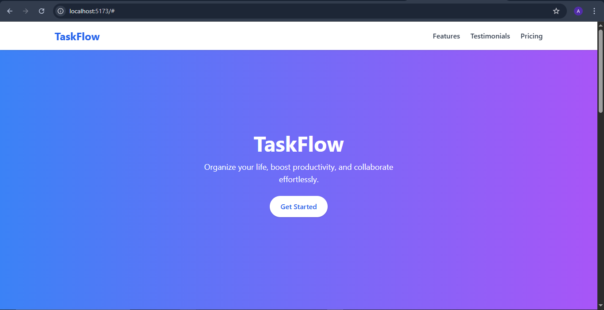
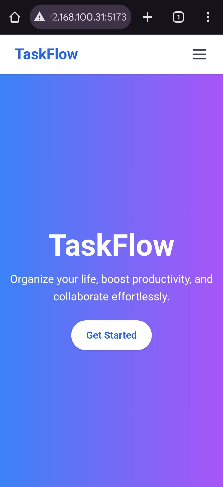
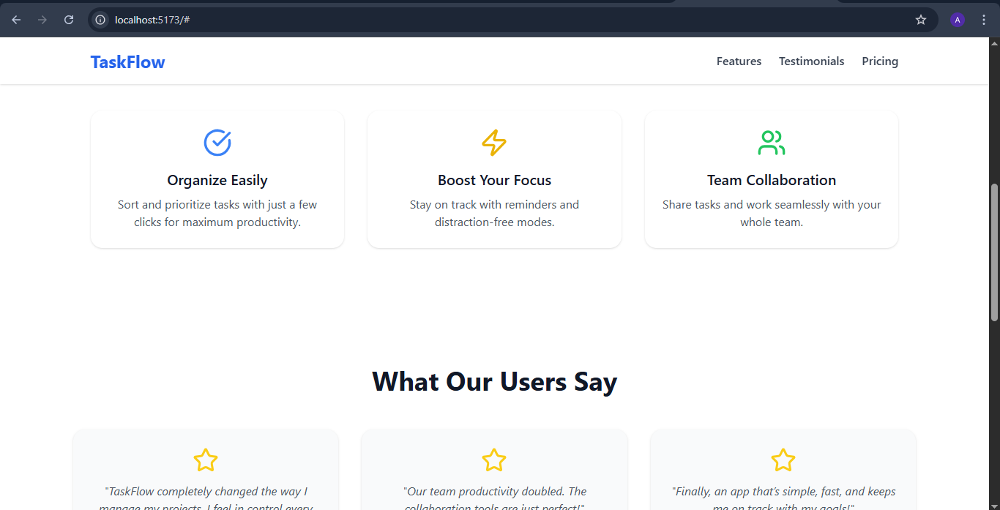
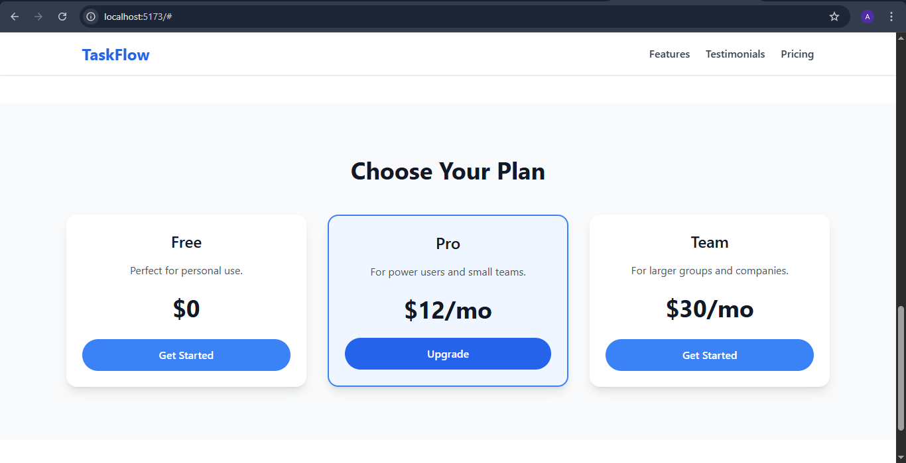

# TaskFlow – Responsive Landing Page

TaskFlow is a fictional productivity app designed to help users **organize their tasks, collaborate with teams, and boost productivity**.  
This repository contains the **landing page** built using **React, Tailwind CSS, and Framer Motion**, with **smooth animations, a responsive layout, and a mobile-friendly navigation bar**.

---

## 🚀 Features

- **Responsive Design** – Works on desktops, tablets, and smartphones.
- **Smooth Scroll Navigation** – Sticky navigation bar with animated scrolling.
- **Interactive Animations** – Sections fade in as you scroll, hover effects on buttons and cards.
- **Framer Motion Integration** – Professional UI transitions.
- **Modern Tailwind Layout** – Clean and minimal UI, easy to customize.

---

## 🖼 Screenshots


### Desktop View


### Mobile View


### Features Section


### Pricing Section


---

## 🛠 Tech Stack

- **React (Vite)** – Fast development environment
- **Tailwind CSS** – Utility-first styling
- **Framer Motion** – Smooth animations
- **Lucide Icons** – Clean, modern icons

---

## 📦 Installation & Setup

Clone the repository and install dependencies:

```bash
git clone https://github.com/4h-m3d/TaskFlow_Landing.git
cd taskflow-landing
npm install
```

Start the development server (with network access for mobile testing):

```bash
npm run dev -- --host
```

Open your browser at the local or network address displayed (for example: `http://192.168.x.x:5173/` to view on your phone).

---

## 📱 Testing on Mobile

1. Ensure your **PC and phone are on the same Wi-Fi**.
2. Run:
   ```bash
   npm run dev -- --host
   ```
3. Look for the **Network URL** Vite shows:
   ```
   Network: http://192.168.1.5:5173/
   ```
4. Enter that URL on your phone’s browser (or create a QR code for quick access).

---

## 🚧 Future Improvements

- **Dark Mode Toggle** – Add light/dark themes.
- **Blog/Updates Section** – Keep users engaged with tips.
- **Form Integration** – Newsletter signups or contact form.
- **Backend API** – Connect with a real task management system.
- **Deployment** – Host on Netlify, Vercel, or GitHub Pages.

---

## 🤝 Contributing

1. Fork this repository.
2. Create a feature branch:
   ```bash
   git checkout -b feature/your-feature
   ```
3. Commit your changes:
   ```bash
   git commit -m "Add your feature"
   ```
4. Push to your fork and create a Pull Request.

---

## 🎬 Directed By

Ahmed Nadeem – Project Oversight & Guidance

---
